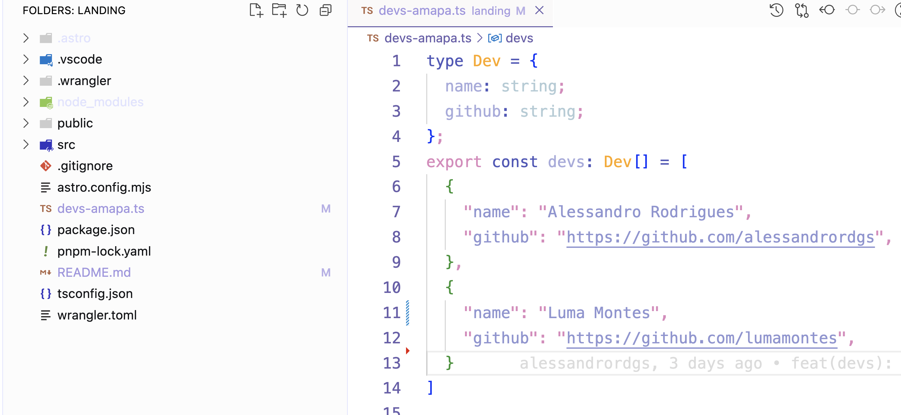

# Landing - PupunhaCode

Esse repositório contém a landing page para a comunidade PupunhaCode!

Nós somos uma comunidade de devs do amapá com o objetivo de ajudar a comunidade de desenvolvedores do Amapá a crescer e se conectar, divulgando projetos, eventos, oportunidades e para fofocar sobre tecnologia. :)

Caso você queira participar da comunidade, entre no nosso [discord](https://discord.gg/TK6qawcd).

Você também pode abrir um pull request pra adicionar seu perfil no site! Basta alterar o arquivo `devs-amapa.ts` na raiz do projeto, adicione sua carinha por lá.



### Tecnologias
  - Astro
  - Cloudflare Workers


# Rode o projeto localmente

```sh
pnpm install
```

```sh
pnpm run dev
```
